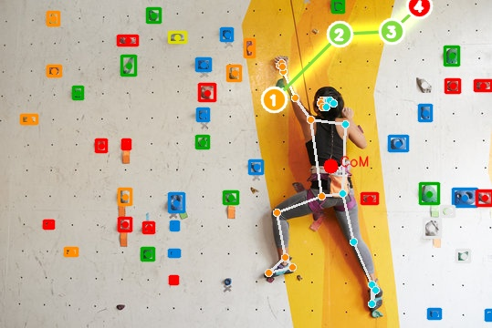

# BetaVision

A computer vision pipeline that watches a bouldering photo or video, finds the holds, tracks the climber, and works out a reasonable "beta" (move sequence) from the ground to the top using A* search over a reachability graph.

## Demo



## System Architecture

```
 Image / Video
       |
       v
 +-----------------------+
 |  YOLOv8 (Hold Detect) |   -> boxes/masks, centroids, HSV color per hold
 +-----------------------+
       |
       v
 +-----------------------+
 |  MediaPipe (Pose/CoM) |   -> joint landmarks, center of mass, limb contacts
 +-----------------------+
       |
       v
 +-----------------------+
 |  Reachability Graph   |   -> holds as nodes, edges gated by climber's reach
 +-----------------------+
       |
       v
 +-----------------------+
 |  A* Search             |   -> lowest-cost hold sequence to the top
 +-----------------------+
       |
       v
 Rendered Overlay (holds + skeleton + beta path)
```

Each stage is its own module (`src/vision/`, `src/kinematics/`) and the CLI (`src/cli/main.py`) just wires them together.

## Core Features

- **Climbing hold detection** (`src/vision/hold_detector.py`) — wraps a YOLOv8 model. Works with proper `-seg` checkpoints (real masks/polygons) and with plain box-only detection checkpoints (synthesizes a rectangular polygon/mask from the bounding box instead), so you're not stuck if the only weights you have are detection-only.
- **Pose & Center of Mass tracking** (`src/kinematics/pose_tracker.py`) — MediaPipe Pose gives joint landmarks; CoM is a weighted average of the hip and shoulder midpoints (hips weighted more since that's closer to where the body's mass actually sits).
- **Limb-contact grounding** (`src/kinematics/reach_graph.py`) — instead of always starting the beta path from an abstract center-of-mass point, the pipeline checks which hold each wrist/ankle is actually close enough to be gripping and starts the path from there. Anchoring to a floating hip point when the climber's hand is clearly already on a hold just gives a worse answer.
- **Hold color detection** (`--route-color`, `--auto-route`) — each hold's dominant color is read off the median HSV value under its mask and bucketed into blue, red, yellow, green, orange, purple, black, or white. `--route-color blue` filters to just that color's holds; `--auto-route` guesses the color by checking which holds the climber's hands/feet are actually touching.
- **Video inference** (`--save-video`) — hold detection runs once on the first frame (the wall doesn't move — well, assuming the camera doesn't either, more on that below) and gets cached; pose tracking, limb contacts, and the beta path recompute every frame, so the overlay updates as the climber moves.

## Setup & Installation

```bash
git clone https://github.com/senkhtuvshin/betavision.git
cd betavision

python3 -m venv venv
source venv/bin/activate
pip install -r requirements.txt
```

You'll also need actual hold-detection weights — the stock `yolov8n-seg.pt` is just COCO-pretrained and has no idea what a climbing hold is. Fastest way to get real weights without training anything yourself:

```bash
python scripts/train_hold_detector.py --download-only
```

This pulls a community checkpoint into `models/pretrained_holds.pt`. Heads up: it's a detection-only model (boxes, no masks), which the box-only fallback above handles fine, but it won't give you real segmentation masks. If you want actual masks/polygons, fine-tune a `-seg` model instead — see `scripts/train_hold_detector.py --help` for the Roboflow dataset option.

## CLI Usage

Run everything as a module from the project root (imports are rooted at `src.`, so `python src/cli/main.py` directly won't find them):

```bash
# Single image, filtered to the blue route, save the annotated overlay
python -m src.cli.main --image data/raw/climb.jpg --weights models/pretrained_holds.pt \
    --route-color blue --save-vis

# Full video, auto-detect the route color, export an annotated mp4
python -m src.cli.main --video-path data/raw/climb.mp4 --start 0 --end 15 \
    --save-video --weights models/pretrained_holds.pt --auto-route
```

| Flag | Description |
|---|---|
| `--image PATH` | Single still image of the wall/climber (mutually exclusive with the two below) |
| `--video-url URL` | YouTube URL to pull a clip from |
| `--video-path PATH` | Local video file |
| `--start` / `--end` | Clip trim points, e.g. `1:23` (required with a video source) |
| `--sample-fps N` | Sample N frames/sec from the video instead of every decoded frame |
| `--save-video` | Process the whole clip and export `annotated_beta.mp4` instead of just grabbing one frame |
| `--save-vis` | Save the annotated overlay image (single-frame mode) |
| `--weights PATH` | YOLOv8 weights, seg or detection-only (default: stock `yolov8n-seg.pt`) |
| `--conf` | Hold detection confidence threshold (default `0.25`) |
| `--height` / `--arm-span` | Climber's height/wingspan in meters (defaults `1.75` / `1.78`) — used to calibrate reach constraints |
| `--route-color COLOR` | Only consider holds of this color |
| `--auto-route` | Guess the route color from the holds nearest the climber's hands/feet |
| `--output-dir DIR` | Where output files go (default `data/processed`) |

## Implementation Details / Notes

- **Apple Silicon**: `mediapipe`'s newer releases (1.0.x) dropped the classic `mp.solutions.pose` API and, on this setup at least, crash outright when running `PoseLandmarker` (a Metal calculator service error, happens on CPU delegate too). Pinned to `mediapipe==0.10.21` instead, which works fine and runs pose inference on CPU via TFLite/XNNPACK. YOLO training (`scripts/train_hold_detector.py`) does use MPS when available via `torch.backends.mps.is_available()`.
- **QuickTime vs. everything else**: OpenCV's `VideoWriter` with the `avc1` fourcc doesn't reliably produce a file QuickTime will play, even though the container is technically valid mp4 (it usually opens fine in Chrome or VLC). If `ffmpeg` is installed, the video pipeline remuxes the output to `libx264` + `yuv420p` afterward, which QuickTime always accepts. If `ffmpeg` isn't found, it just keeps the direct OpenCV output — still watchable, just maybe not in QuickTime specifically.
- **Static camera assumption**: video mode detects holds once from frame 1 and reuses those positions for the whole clip. That's fine for a locked-down tripod shot, but if the camera pans, zooms, or shakes, the cached hold markers will drift out of alignment with the actual wall as the video goes on. There's no frame registration or periodic re-detection to compensate for that yet.
- **Reach units**: `ClimberProfile` (in `reach_graph.py`) works in pixels, not meters, since that's what hold centroids are in. The CLI converts your `--height`/`--arm-span` meters into pixels by calibrating off the detected pose's shoulder-to-ankle span in the first frame it can. If no pose is ever detected, it falls back to a rough flat scale and logs a warning.
